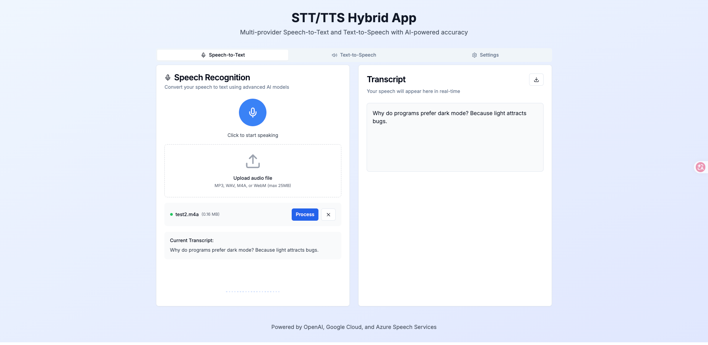
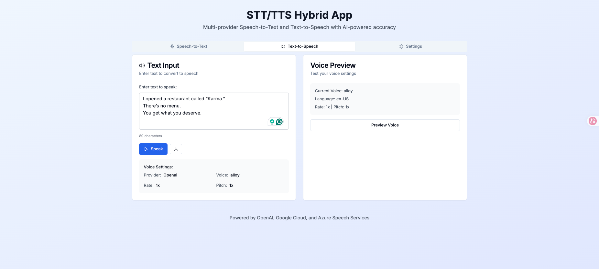
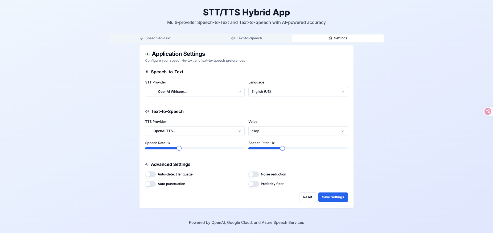

# STT/TTS Hybrid

A Next.js + TypeScript app providing real-time and file-based speech-to-text and text-to-speech with multi-provider support (OpenAI Whisper/TTS, Google Cloud, Azure Speech, and browser fallbacks). Includes a settings panel, audio visualizer, and easy export of transcripts.

## Quick Start

Requirements:
- Node.js 18+ and npm
- An OpenAI API key (required for server-side features)

Install and run:

```bash
npm install
npm run dev
```

Open http://localhost:3000 in your browser.

## Environment

Copy the example env and add your keys:

```bash
cp .env.example .env.local
# then edit .env.local and add:
# OPENAI_API_KEY=your_key_here
```

Important variables:
- `OPENAI_API_KEY` — required for `/api/transcribe`, `/api/synthesize`, and `/api/chat`
- Optional: `GOOGLE_CLOUD_*`, `AZURE_SPEECH_*` for Google/Azure providers

Note: `.env.local` is listed in `.gitignore` — do not commit secrets.

## How it works (developer notes)

- The UI uploads audio to `/api/transcribe` (server-side Next.js API route).
- The server calls provider SDKs/APIs and returns a JSON object. Recent providers return `{ "text": "..." }`.
- The app `SpeechToText` component now handles both `{ text }` and legacy `{ transcript }` response shapes.

If you process an audio file successfully but don't see text in the Transcript panel, open DevTools → Network → inspect the `/api/transcribe` response to confirm it includes a `text` field.

## Common Tasks

- Export transcript: use the download button in the Transcript panel.
- Change STT/TTS provider or language in Settings.

## Troubleshooting

- ECONNRESET or APIConnectionError: check network, VPN/proxy/firewall, and OpenAI status (https://status.openai.com/).
- 401/permission errors: ensure `OPENAI_API_KEY` is set in `.env.local` and the dev server was restarted.
- Unsupported metadata/viewport warning (Next.js 14): `app/layout.tsx` now exports `viewport` separately; update other pages if you define `viewport` inside `metadata`.

## Testing & Lint

Run type-check and linting:

```bash
npm run type-check
npm run lint
```

Run tests (note: coverage thresholds may be configured):

```bash
npm test
```


## Contributing

Please open issues or PRs on the project repository. Keep secrets out of commits and follow the codebase conventions (TypeScript `strict: true`).

## Assets

This repo contains an `assets/` folder with example/demo images used by the UI. Replace these placeholders with real artwork as needed:

- 
- 
- 

---

This README is intended to make local development and debugging faster. For more detailed design and proposals see the `docs/` directory.
